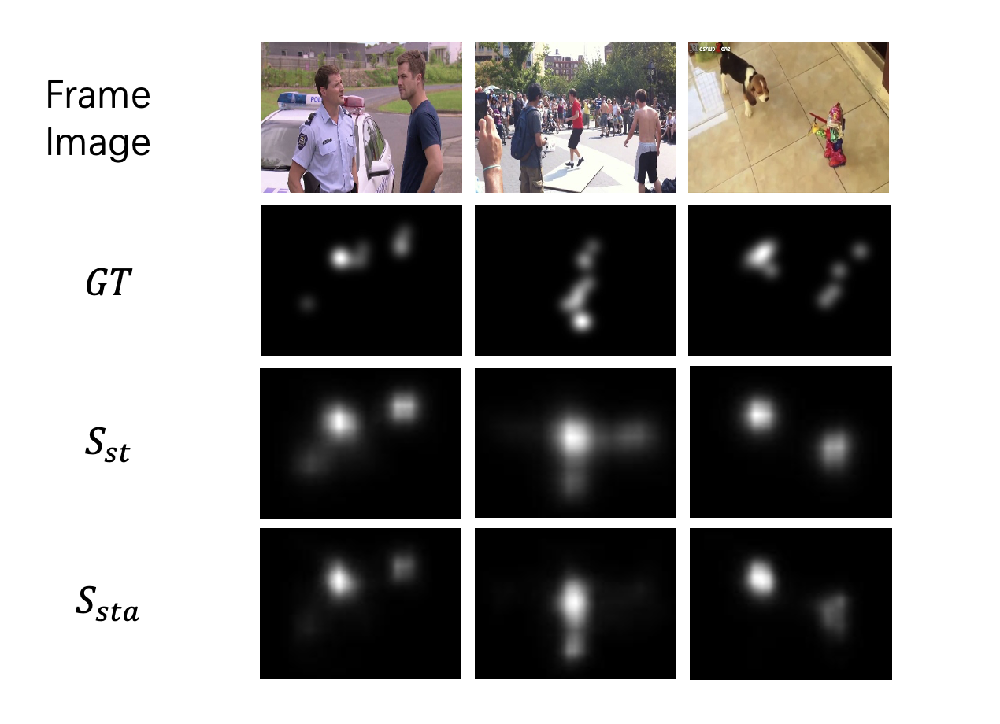

# CS386 - Assignment 2

Code repository for CS386 Assignment 2. **AV-Saliency: Audio Visual Saliency Detection** @SJTU

## Description

In this assignment, I design a DNN model for Audio Visual Saliency Detection using backbone of ResNet-50 and SoundNet.



## Requirements

* Python 3.7
* PyTorch 1.5.0

You can install the required python packages with the command: 
```bash
pip install -r requirements.txt
```

## Fetch data and models

You can run the following script that downloads and extract all the required meterial: 
```bash
bash fetch_data.sh
```

## Run training and testing code

Assume the structure of data directories is that provided by the script ```fetch_data.py```.

```misc
STAViS/
  data/
    video_frames/ 
        .../ (directories of datasets names) 
    video_audio/ 
        .../ (directories of datasets names)
    annotations/ 
        .../ (directories of datasets names) 
    fold_lists/
        *.txt (lists of datasets splits)
    pretrained_models/
        stavis_visual_only/
            visual_split1_save_60.pth
            visual_split2_save_60.pth
            visual_split3_save_60.pth
        stavis_audiovisual/
            audiovisual_split1_save_60.pth
            audiovisual_split2_save_60.pth
            audiovisual_split3_save_60.pth
        resnet-50-kinetics.pth
        soundnet8.pth
```

* Train audiovisual models for all splits and produce the resulting saliency maps for the test sets:
```bash
bash run_all_splits_audiovisual_train_test.sh
```

* Produce saliency maps for all splits' test sets using our trained STAViS audiovisual models:
```bash
bash run_all_splits_audiovisual_test.sh
```

## Run evaluation code

I rewrite the evaluation code of Matlab in python, so you can simply run `eval.py` to evaluate your models.

```shell
python eval.py --result-dir './experiments/audiovisual_test'
```

Remember to specify the `--result-dir` to the directory that saves model's prediction results.

## References
[1] [A. Tsiami, P. Koutras and P. Maragos. STAViS: Spatio-Temporal AudioVisual Saliency Network. CVPR 2020.](http://openaccess.thecvf.com/content_CVPR_2020/html/Tsiami_STAViS_Spatio-Temporal_AudioVisual_Saliency_Network_CVPR_2020_paper.html)

[2] [P. Koutras and P. Maragos. SUSiNet: See, Understand and Summarize it. CVPRW 2019.](http://openaccess.thecvf.com/content_CVPRW_2019/html/MBCCV/Koutras_SUSiNet_See_Understand_and_Summarize_It_CVPRW_2019_paper.html)

[3] [K. Hara, H. Kataoka and Y. Satoh. Can Spatiotemporal 3D CNNs Retrace the History of 2D CNNs and ImageNet?. CVPR 2018.](http://openaccess.thecvf.com/content_cvpr_2018/html/Hara_Can_Spatiotemporal_3D_CVPR_2018_paper.html) 

[4] [Y. Aytar, C. Vondrick and A Torralba. SoundNet: Learning Sound Representations from Unlabeled Video. NIPS 2016.](https://arxiv.org/abs/1610.09001)

## License

The code is released under the MIT license.
